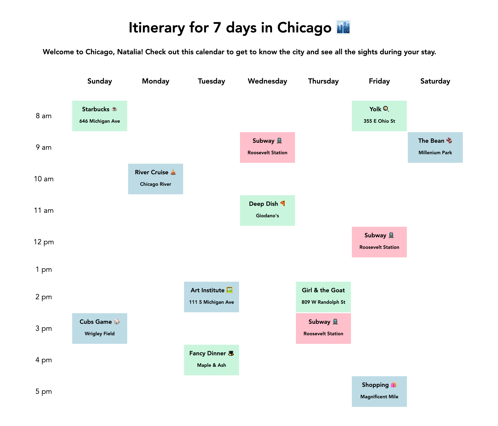

# 📅 Timetabled

**Timetabled** is a grid-style weekly calendar app that allows you to plan a **single week** with one-hour events. Users can create personalized itineraries with event titles, colors, descriptions, and locations for each time block. Perfect for real or imaginary trips, historical figures, or even pets!

---

## 📸 Screenshot

---

## 🗓 7-Day Itinerary Example – Chicago Trip

**Sunday:**  
- **8:00 am**: Starbucks – Start your day with coffee at a local Starbucks  
- **9:00 am**: The Bean – Visit the iconic Cloud Gate at Millennium Park  
- **10:00 am**: River Cruise – Take a scenic boat tour along the Chicago River  

**Monday:**  
- **12:00 pm**: Yolk – Enjoy a delicious breakfast or brunch  
- **1:00 pm**: Art Institute – Explore one of the best art museums in the country  
- **2:00 pm**: Girl & the Goat – Indulge in award-winning dishes at this famous restaurant  

**Tuesday:**  
- **10:00 am**: Cubs Game – Catch a game at Wrigley Field  
- **3:00 pm**: Shopping – Shop along the Magnificent Mile  

**Wednesday:**  
- **12:00 pm**: Deep Dish Pizza – Try Chicago's famous deep dish pizza at a local pizzeria  

**Thursday:**  
- **8:00 am**: Subway R – Grab a quick breakfast at a nearby subway station  
- **5:00 pm**: Fancy Dinner – End your day with a fine dining experience  

**Friday:**  
- **10:00 am**: River Cruise – Take another relaxing river cruise  

**Saturday:**  
- **11:00 am**: Cubs Game – Return to Wrigley for another thrilling Cubs game  

---

## ✨ Features

- **One-Week Calendar**  
  - Grid-style layout with **one-hour time blocks** for all 7 days  
  - Each block can hold **custom events**  

- **Event Titles**  
  - Unique titles for easy identification  

- **Event Colors**  
  - Color-coded based on **type** (work, leisure, exercise, meals)  

- **Event Descriptions & Locations**  
  - Each block can include detailed **descriptions** and **locations**  

---

## 🛠 Built With

- HTML / CSS / JavaScript  
- Grid-style layout for the calendar  
- Color-coded event blocks  

---

## 📜 License

    Copyright [2025] [Kelvin Mathew]

    Licensed under the Apache License, Version 2.0 (the "License");
    you may not use this file except in compliance with the License.
    You may obtain a copy of the License at

        http://www.apache.org/licenses/LICENSE-2.0

    Unless required by applicable law or agreed to in writing, software
    distributed under the License is distributed on an "AS IS" BASIS,
    WITHOUT WARRANTIES OR CONDITIONS OF ANY KIND, either express or implied.
    See the License for the specific language governing permissions and
    limitations under the License.